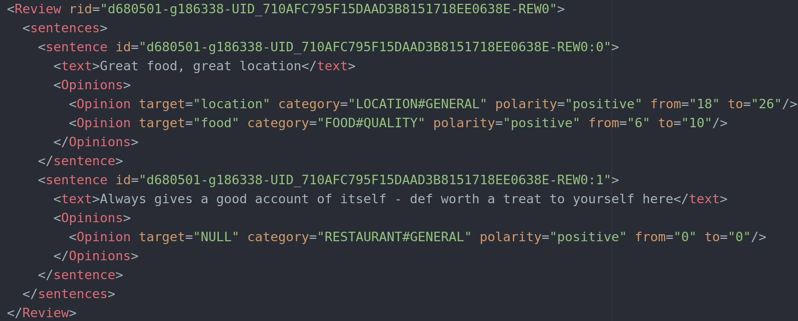

# TripR-2020Large dataset


**Trip**advisor **R**estaurant **2020** **Large** (TripR-2020Large) is a manually annotated dataset that contains restaurant reviews which are evalaluated through the TripAdvisor platform by multiple users. It is suitable for sentiment analysis tasks as well as for evaluating decision-making models that incorporate sentiment analysis.

The Trip-2020Large dataset provides the reviews of 132 experts evaluating 4 restaurants located in the city of London. Not all experts evaluate all the restaurants. The dataset collects 474 reviews. In particular, each review is given by attributes:

- Concerning the restaurant: name, identifier code, location name, and location identifier code.
- Concerning the expert: name, identifier code, and location name.
- Concerning the review: title, body, date, general rating, food rating, service rating, and value rating.

We show the main features of the TripR-2020Large dataset:

| Experts      | Restaurants | Reviews | Sentences |
| ----------- | ----------- | ----------- | ----------- |
| 132 | 4 | 474 | 2,522 |


We consider the TripR-2020Large dataset to evaluate the **C**rowd **D**ecision **M**aking guided by **S**entiment **A**nalysis (**CDM-SA**) model, which is a large scale decision making model with sparse representation able to process evaluations from social networks for leveraging the wisdom of the crowd. If desired, the TripR-2020Large dataset can be used for aspect based sentiment analysis tasks without the need of incorporating decision making.


## Annotation
We annotate the TripR-2020Large dataset at aspect level by depicting the 474 reviews into 2,522 sentences. The dataset is annotated by three experienced researchers following the annotation guidelines TripR-2020Large, that follows the official SemEval-2016 annotation manual. There is substantial agreement of 0.66 between the three annotators based on the Fleiss’s coefficient metrics. We show the main features of the annotation:

| Features      | Value |
| ----------- | ----------- |
| Num. Sentences      | 2,522       |
| Num. Opinions   | 2,586        |
| Num. Pos. Opinions | 2,107 |
| Num. Neg. Opinions | 397 |
| Aspect categories | Restaurant, Food, Service, Drinks, Ambience and Location|
| Polarities value | positive, negative and neutral|

The 474 reviews from the dataset are split into 2,522 sentences. We labelled 2,586 opinions of which 2,107 are positive, 397 are negative and the rest are neutral opinions.


## Example
We show an example of the annotation of a review from the TripR-2020Large dataset:



The review is split into sentences. The first one presents two opinions and the second shows only one opinion. The opinions are identified by: 1) the "target" element, i.,e., the aspect term discussed in the opinion, 2) the "category" element, i.e., the aspect category to which the aspect term is associated, 3) the "polarity" element, i.e., the sentiment expressed by the opinion, 4) the "from" element, which is the first character of occurrence of the target, and 5) the "to" element, which is the last character of occurrence of the target.   


## Citation
Please use the following citation:

```
C. Zuheros, E. Martínez-Cámara, E. Herrera-Viedma and F. Herrera, "Crowd Decision Making: Sparse Representation Guided by Sentiment Analysis for Leveraging the Wisdom of the Crowd," in IEEE Transactions on Systems, Man, and Cybernetics: Systems, 2022, doi: 10.1109/TSMC.2022.3180938.
```


## Contact
María Cristina Zuheros Montes - czuheros@ugr.es


## License
<a rel="license" href="http://creativecommons.org/licenses/by-sa/4.0/"></a><br />This work is licensed under <a rel="license" href="http://creativecommons.org/licenses/by-sa/4.0/">Creative Commons Attribution-ShareAlike 4.0 International License</a>.
